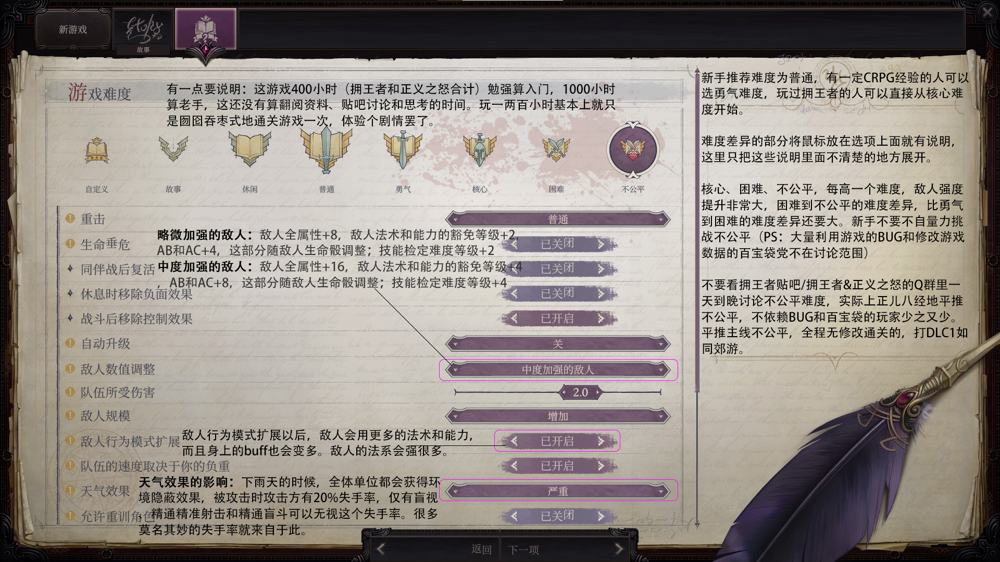
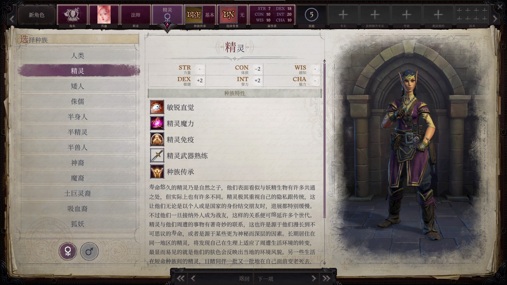
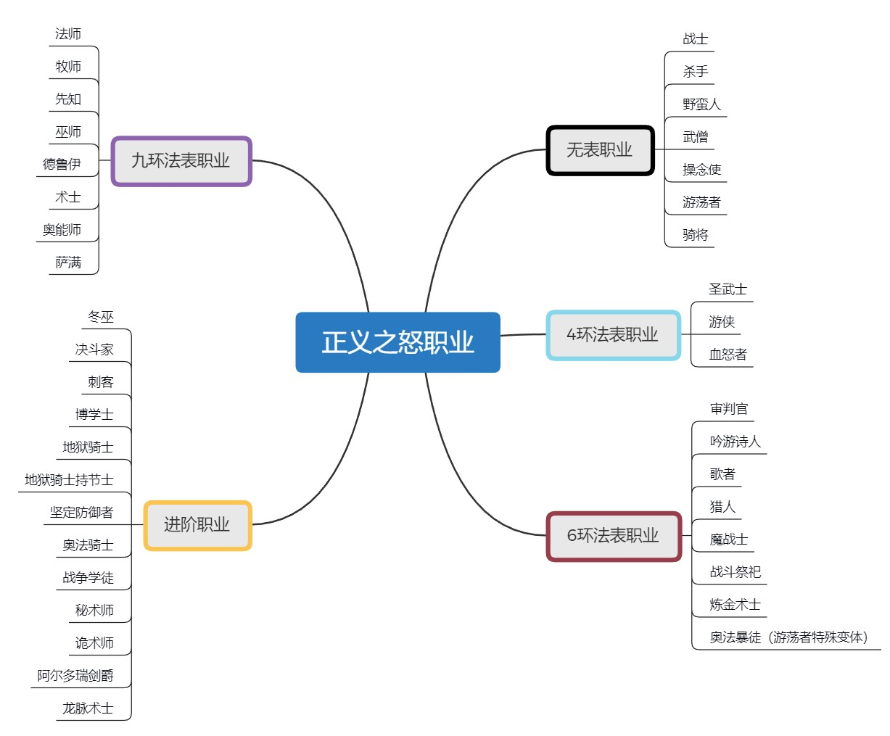
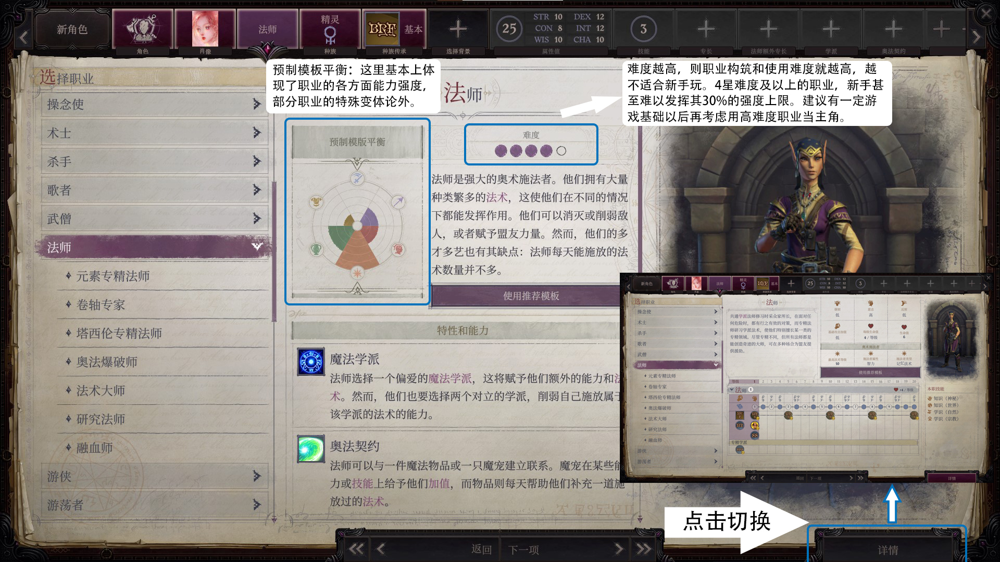
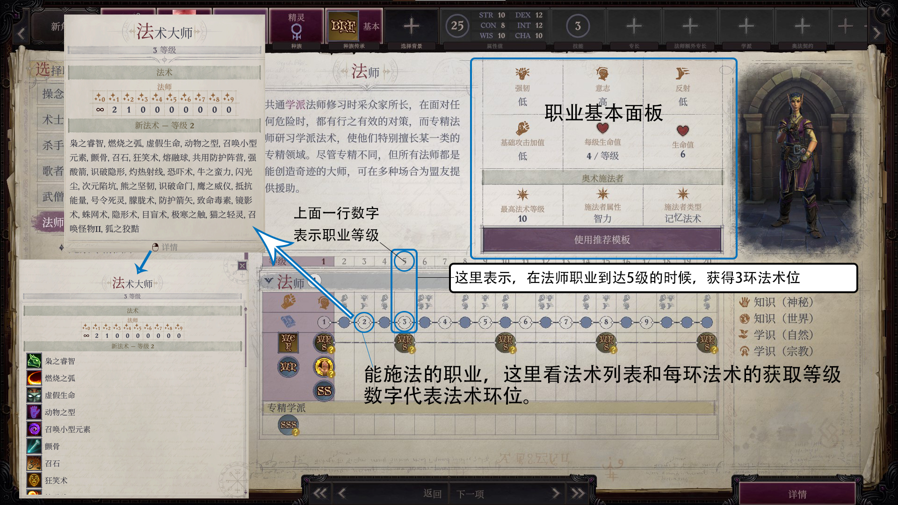
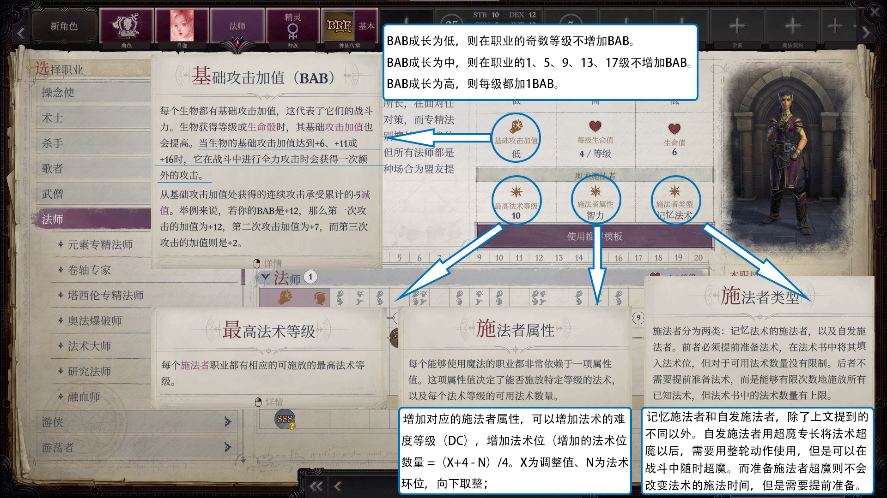
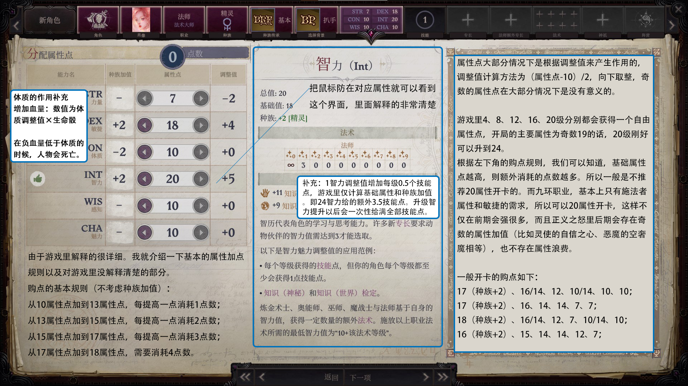

# 《开拓者：正义之怒》进阶手册

## 前言

## 友情链接

## 游戏难度解析

## 种族解析

**种族的属性加值，最好要跟职业的主属性和副属性对应（比如法师用精灵）。除此之外，种族一般可以选择自己喜欢的或者与玩法对应的。**

**游戏里有12个种族可供选择，但是原版的强力种族和高颜值/高人气种族就几种。**

人类：万金油种族，比其他种族多1个初始专长，每级多一个技能点，可以说原版大部分职业的用人类开卡都是最优的选择。

精灵：敏智种族，适合法师、奥能师和巫师等一系列依赖智力和敏捷的施法职业。

神裔：特点是双属性+2且没有属性减值，附带一个类法术，10级解锁种族专长【飞翼】（不过每个道途后期都送飞翼），适合不太缺专长但要双高属性的职业。

半精灵：种族传承选择亲眷以后可以实现+4魅力【种族】，可以开局22魅力，适合非常依赖魅力的职业，比如术士/先知。

狐妖：特点是拥有狐妖和人双形态，而且惑控系法术的豁免难度（DC）+1，种族专长【灵狐猛扑】（先决条件为BAB+10）是获得猛扑的好办法，适合敏系近战职业和惑控系施法者。

半身人：敏魅种族，种族传承选择急行可以让基本移动速度变回30尺而且先攻+2，而且天生体型为小体型（+1AB、1AC和4隐匿，但是武器伤害骰变小）。

吸血裔：特点是负能量亲和（受到正能量掉血，负能量加血）以及抵抗等级流失，前期加血手段变成造成轻/中/重伤卷轴。

## 职业界面详解

**开拓者系列的职业设计，大致遵循一个原则**：即基础攻击加值（即BAB）、法术、额外专长和职业能力四者的取舍，但是不像竞技网游那样追求绝对的平衡性。也就是说某些职业会特别强、某些职业就会比较平庸。一个职业的基础攻击加值（BAB），最高法术等级及职业能力，三者共同决定了这个职业的玩法，而且额外专长数量越多则表示这个职业的专长成型越快，前期强度会越高。

在游戏里，不计算职业变体的话，一共有38种职业可供选择，共计25个基本职业和13个进阶职业，根据能否施法以及最高可以使用几环法术，可以将职业大致区分为无表职业、4环职业、6环职业、9环职业（在正义之怒里，如果选择对应的神话道途，可以跟神话道途合并法术书，变为10环职业）。

需要注意的是，大部分进阶职业都是不如基础职业好用的。

## 属性加点解析

**基础的属性加点解析如下图所示**

